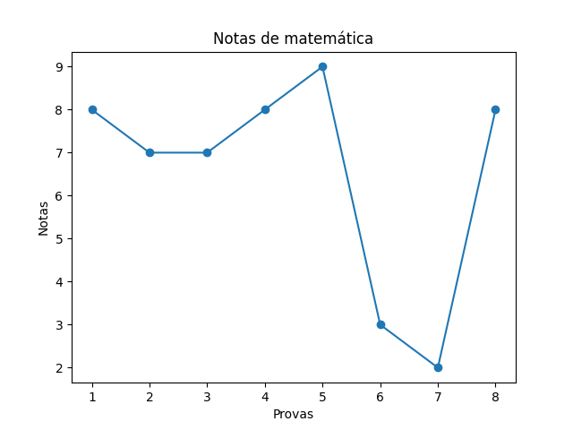

<h1 align="center">
  <div>
    
  </div>
  Alura Python Data Science Intro
<br>
</h1>

<h4 align="center">Project developed in the alura`s course of introduction data science with python.</h4>

<div align="center">
  
</div>

<br>

> Course: https://cursos.alura.com.br/course/python-intro

<h2 id="about-the-project"> :pencil: About The Project</h2>

<p align="justify">
  In this project was learned the introduction about the Python language with focus in Data Science, learned topics:

- Functions
- Parameters and conditions
- Type casting
- List, loops and booleans
- Import libs
- Graphs with Matplotlib

</p>

<h2 id="getting-started"> :runner: Getting Started</h2>

<p align="justify">
  To run the project locally follow these steps:
</p>

<h3 id="prerequisites"> :warning: Prerequisites</h3>

- [Python](https://www.python.org/downloads/) Prefer to install the LTS version.
- [Matplotlib](https://pypi.org/project/matplotlib/) Prefer to install with [pip](https://pypi.org/).

<h3 id="installation"> :construction_worker: Installation</h3>

<p align="justify">
  1. To clone the project, run this command:
</p>

```
git clone https://github.com/arrudadev/python-data-science.git
```

<h3 id="usage"> :metal: Usage</h3>

<p align="justify">
  Chose one file and run it:
</p>

```
python3 greetings.py
```

<hr />

<a href="https://www.alura.com.br/">
  
</a>
